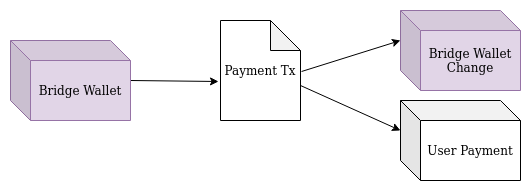

# Rosen Bridge
A brief description about Rosen Bridge
## Bridge Components

Before explaining the main idea and procedures, it's better to get familiar with its components:

### Tokens

1. **Rosen Bridge Token (RSN):** Its a token. each watcher need some RSN to work with system
2. **Ergo Watcher Rosen Token (EWR):** It's a chain specific token. For each blockchain we have an EWR token.
3. **Guard NFT:** this is a guard identifier token. this token locked in a multisig address. so n of m guard must sign this box.
4. **Cleanup NFT:** this token used for cleanup service. 
5. **User Payment Token (UTP!!):** After locking some RSN and get some EWR for each watcher a new UTP issued. creating event need this token. also fee pay to this token

### Contracts

1. **Watcher Bank**: This contract is system configuration for each chain. In this contract we store number of locked RSN.
   this box also contain EWR to RSN Factor, Watcher required percent, Max Watcher required count.
2. **Watcher Lock**: Each watcher lock his/her EWR tokens in this address. this box has UTP in R4. so when watcher wants to create event or redeem EWR to RSN must pay his/her UTP in inputs.
3. **Watcher Commitment**: When a watcher detect a new event on target chain create a commitment. this commitment contain 
   1. User UTP
   2. Commitment Hash
   3. Request Id: blake2b256(txId on target chain)
4. **Trigger Event**: When some Watcher creates commitment for same request one of them reveal it using event content. Guards watch this event for payment
5. **Watcher Fraud Lock**: If some watchers create a fake event a cleanup service move tokens to fraud lock contract. then back it to bank and slash RSNs.

### Data
1. **Event**: any payment request from one chain to other chain. event contain:
   1. Source tx id
   2. From chain
   3. To chain
   4. From address
   5. To address
   6. Amount
   7. Fee
   8. Source chain token id
   9. Target chain token id
   10. Source block id

2. **Commitment for user with UTP**: blake2b256 hash of concat event data with user UTP

## Rosen Bridge Life Cycle

Each Watcher must do these steps. locking phase occurred once for each watcher.

### Phase 1: Locking RSN

Each user can lock his/her RSN in one gateway bank. and get some EWR. these EWR used to create events.
In this transaction. This process done in one transaction. In this transaction
* User must spend current bank and create new bank. 
  * Append input bank id as UTP to bank R4
  * Append EWR token bought to R5
  * Move EWR Tokens to lock contract and add RSN tokens to bank. (EWR to RSN Factor used)
* Create lock box contain all EWR tokens in it. also write input bank id in R4
* Issue UTP token with input bank box id.

1. **Payment**: The raffle creator must pay the required fee to the raffle creator proxy contract (This step can be passed by creating the raffle throw the raw scripts by an advanced user).

2. **Token Issue**: Each raffle has a set of unique tokens for itself. In this step, the creator payment is spent to issue the raffle ticket tokens. At the same time, the raffle box is created by paying one RST to the raffle box. Thus this step has two outputs, *Raffle Ticket Repo* box and *Inactive Raffle* box.

3. **Merge**: The outputs of the previous step merge to create the *Active Raffle* box.

### Phase 2: Commitment

Each watcher looks on target chain. If new event occurred, Store event data in local database for future use.
Then create commitment box.

In this transaction

* Spent Locked box
* Spent a box contain his/her UTP as first token.
* Any other lock box floating in network can be merged in this transaction. (See Phase 4)
* All EWR must be in `Output[0]` this contract must send to lock address again. this box also contain user UTP in R4
* User can create one commitment box contain only one EWR in it. Also, commitment information stored in this box. So box registers are
  * R4: UTP
  * R5: blake2b256(request transaction id on target chain)
  * commitment
  * lock contract script hash

### Phase 3: Redeem Commitment

In any time your can redeem his/her commitment if it doesn't merge with other commitments.
This transaction is simple
Only pay commitment box and create lock box contain EWR. Also, user UTP must spend as first token of second input.

### Phase 4: Reveal Commitment

When some watcher creates commitment for same event, One of them must reveal commitment.
First watcher must find all commitment with same id.
Then filter commitments and verify if event data is same or not.
Then create a transaction with all commitments as input. and one trigger event in output.
trigger event registers are:
* R4: list of all UTPs merged in this transaction.
* R5: Event data parts.
* R6: Lock contract hash

## Phase 5: Guard Payment Process

guards find all trigger events and after required confirmation negotiate together.
Then create a transaction to pay expected token to user.
If user requested to pay token other chain (Not Ergo)
guard pay tokens to user. after confirmation of request on target chain create a transaction like this.
* spend event as first input.
* find any commitment which not merged in event and spend as input.
* wrapped token bank to pay fee.
* for any used merged in trigger event create one lock contain one EWR and share of fee.
* for any not merged commitment create lock box contain EWR and share of fee.
* pay share of guard's fee to any address.
* write target chain TxId on first box. this information only used for creating statistics.

if user requested tokens on ergo no transaction generated on other chain.

above transaction generated and one box added to end (user payment)

### Phase 5': Fraud detected

If guards can't verify event do nothing. 
then cleanup service after a while come and move this event and slash EWR tokens.
this process has two steps

1. **Create Fraud boxes**: Service spent event and for each UTP stored in trigger event create one fraud box. 
this box contain one EWR 

2. **Redeem Fraud boxes**: For each Fraud boxes created spend it redeem content to bank.
then pay RSN to any address required.

in both transaction service must spend cleanup token

### Phase 6: User collect fees

each user share of fee stored in lock box generated by guards. any time user can spend this box using UTP
and create new lock box and withdraw fees to any address. in this phase user can merge Locked boxes
or create event.
